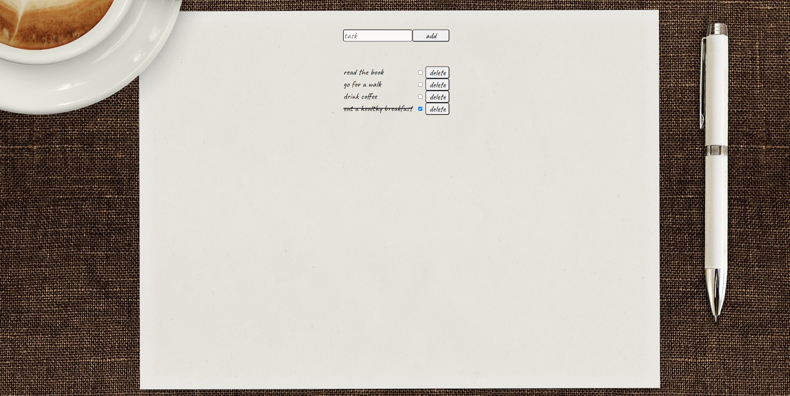

# Functions

The application "To Do List" allows the user to add, delete and mark tasks as completed. Additionally, the application includes unit tests for key functionalities.

Frontend part:
- User Interface:
    - To-do list.
    - Text box for entering a new task.
    - Button for adding a new task.
    - For each task, there is a button to delete it and a checkbox to mark it as completed.
- Functionality:
    - Adding a new task to the list.
    - Delete a task from the list.
    - Marking a task as completed (changing the task's appearance to a crossed out one).
- Unit tests:
    - Test adding a new task.
    - Task deletion test.
    - Test marking a task as completed.

Backend part:
- Endpoints:
    - POST /tasks - adding a new task.
    - DELETE /tasks/:id - deleting a task.
    - PATCH /tasks/:id - task update (marked as completed).
- Data model:
    - Task: { id: number, content: string, done: boolean }
- Unit tests:
    - Endpoint test for adding a task.
    - Task deletion endpoint test.
    - Task update endpoint test.

## How to run the application

Prerequisite
npm version 9.5.0 must available on command line

First run the backend as described below in a console terminal
Then run the frontend as described below in another console terminal

- Backend
Change to the directory "to-do-list-backend".
Run "npm install"
Run "npm start"

- Testing backend
Prerequisite: "npm install" has already been run for the backend

Open new console terminal
Change to the directory "to-do-list-backend".
Run "npm install --save-dev jest"
Run "npm test"

- Frontend
Change to the directory "to-do-list-frontend".
Run "npm install"
Run "npm start"

- Testing frontend
Prerequisite: "npm install" has already been run for the frontend

Open new console terminal
Change to the directory "to-do-list-frontend".
Run "npm install --save-dev jest"
Run "npm test"

### Desktop overview layout

